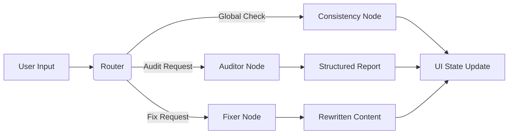

# Project Charter AI Auditor 🛡️🤖

[](https://streamlit.io)
[](https://python.langchain.com)
[](https://langchain-ai.github.io/langgraph/)
[](https://www.python.org/)

An intelligent document review system designed to audit Project Charters against specific criteria. Built with **Streamlit** for the frontend and **LangGraph** (powered by **OpenAI**) for the backend agentic workflow.

This tool helps Project Managers and Quality Assurance teams ensure documentation compliance by automatically detecting missing information, placeholders, or vague content, and offering an AI-powered "Auto-Fix" capability.

---

## 🚀 Features

- **Template Management**: Load standard project templates (e.g., Problem Statements, Objectives) or create custom sections.
- **PDF Import**: Upload existing Project Charter PDFs and automatically extract structured sections using AI.
- **Example Charter with "Mistakes"**: Load a pre-filled charter with intentional errors (Missing Info, Contradictions, Formatting issues) to test the AI's capabilities.
- **AI Auditing**: Detailed analysis of text against strict criteria (Audit Node).
- **Severity Scoring**: Categorizes issues as High (Critical), Medium (Partial), or Low (Formatting).
- **Auto-Fix Agent**: A specialized "Fixer Node" that rewrites content to resolve specific issues while preserving the original context.
- **Global Consistency Check**: Analyzes the entire document to find logical contradictions between sections.
- **Interactive UI**: Visual feedback with Bosch-branded styling and real-time state management.

---

## 🏗️ Architecture

The backend utilizes **LangGraph** to manage the state between the Auditor and the Fixer.



## 🛠️ Installation & Setup

1. Prerequisites

   - Python 3.10 or higher
   - A valid OpenAI API Key (starts with sk-...)

2. Clone the Repository

```Bash
git clone https://github.com/your-username/project-charter-auditor.git
cd project-charter-auditor
```

3. Virtual Environment
   It is recommended to use a virtual environment.

```Bash

python -m venv venv
# On Windows
venv\Scripts\activate
# On macOS/Linux
source venv/bin/activate
```

4. Install Dependencies
   Create a requirements.txt based on the imports (or use the command below):

```Bash
pip install -r requirements.txt
pip install -r requirements_dev.txt  # For testing
playwright install  # For E2E tests
```

## ⚙️ Configuration

### Authentication
The app is protected by a simple password mechanism. 
Set the password in `.streamlit/secrets.toml`:

```toml
app_password = "your-secure-password"
```

### LLM Credentials
Create a `.streamlit/secrets.toml` file (or use `.env` if configured) to store your keys securely.

> ⚠️ Security Note: Never commit your actual API keys to GitHub.

```toml
# .streamlit/secrets.toml

[secrets]
OPENAI_API_KEY = "sk-..."
OPENAI_MODEL_NAME = "gpt-4o"
```

## 🧪 Testing

This project uses **pytest** for comprehensive testing, including Unit, Functional, and E2E (Playwright) tests.

### Running Tests

```bash
# Run all tests
python -m pytest

# Run only functional tests
python -m pytest tests/functional

# Run E2E Acceptance tests (Requires Playwright browsers)
# Set RUN_E2E_TESTS=true to enable them
RUN_E2E_TESTS=true python -m pytest tests/acceptance
```

## 🏃‍♂️ Usage

1. **Start the App**:
   ```Bash
   streamlit run main.py
   ```

2. **Login**: Enter the password configured in `secrets.toml`.

3. **Workflow**:
   *   **Create Document**: Expand **"New Document"** in the sidebar and select a template (e.g., "Example PMBOK Project Charter" with intentional errors).
   *   **Import PDF**: Expand **"Import Charter"** to upload an existing charter and extract structured sections.
   *   **Review Section**: Click **"Review"** on any section to see the AI flag issues like missing names or formatting problems.
   *   **Global Check**: Expand **"Document Consistency"** to find logical contradictions across sections.
   *   **Auto-Fix**: Click **"Auto-fix"** on fixable issues to let the AI rewrite the content automatically.
   *   **AI Connection**: Configure API credentials under **Administration → AI Connection** (collapsed by default when system credentials are loaded).

## 📂 Project Structure

```Plaintext
.
├── main.py                  # Main Entry Point
├── requirements.txt         # App Dependencies
├── requirements_dev.txt     # Testing Dependencies
├── app/
│   ├── components/          # UI Widgets (Sidebar, Editor, Chat, Alerts)
│   └── state_manager.py     # Session State & Data Management
├── backend/
│   ├── graph/               # LangGraph Workflow & Nodes
│   ├── ingestion.py         # PDF Import Pipeline (MarkItDown + LLM)
│   └── chat.py              # Chatbot Logic
├── data/
│   └── template_registry.py # Templates & Criteria (Includes Example Charter)
└── tests/
    ├── unit/                # Unit Tests
    ├── functional/          # Functional Tests (State Logic)
    ├── acceptance/          # E2E Tests (Playwright)
    └── e2e/                 # Full Workflow Tests
```
