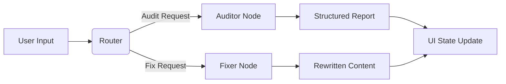

# Project Charter AI Auditor 🛡️🤖

[](https://streamlit.io)
[](https://python.langchain.com)
[](https://langchain-ai.github.io/langgraph/)
[](https://www.python.org/)

An intelligent document review system designed to audit Project Charters against specific criteria. Built with **Streamlit** for the frontend and **LangGraph** (powered by **OpenAI**) for the backend agentic workflow.

This tool helps Project Managers and Quality Assurance teams ensure documentation compliance by automatically detecting missing information, placeholders, or vague content, and offering an AI-powered "Auto-Fix" capability.

---

## 🚀 Features

- **Template Management**: Load standard project templates (e.g., Problem Statements, Objectives) or create custom sections.
- **AI Auditing**: Detailed analysis of text against strict criteria (Audit Node).
- **Severity Scoring**: Categorizes issues as High (Critical), Medium (Partial), or Low (Formatting).
- **Auto-Fix Agent**: A specialized "Fixer Node" that rewrites content to resolve specific issues while preserving the original context.
- **Interactive UI**: Visual feedback with Bosch-branded styling and real-time state management.

---

## 🏗️ Architecture

The backend utilizes **LangGraph** to manage the state between the Auditor and the Fixer.



## 🛠️ Installation & Setup

1. Prerequisites

   - Python 3.10 or higher
   - A valid OpenAI API Key (starts with sk-...)

2. Clone the Repository

```Bash
git clone [https://github.com/your-username/project-charter-auditor.git](https://github.com/your-username/project-charter-auditor.git)
cd project-charter-auditor
```

3. Virtual Environment
   It is recommended to use a virtual environment.

```Bash

python -m venv venv
# On Windows
venv\Scripts\activate
# On macOS/Linux
source venv/bin/activate
```

4. Install Dependencies
   Create a requirements.txt based on the imports (or use the command below):

```Bash

pip install streamlit langchain langchain-openai langchain-core langgraph pydantic python-dotenv
```

## ⚙️ Configuration

Create a `.env` file in the root directory. You can copy the structure below.

> ⚠️ Security Note: Never commit your actual API keys to GitHub.

Ini, TOML

# .env file

```
# OpenAI Configuration
OPENAI_BASE_URL=[https://your-resource-name.openai.com/openai/v1/](https://your-resource-name.openai.com/openai/v1/)
OPENAI_API_KEY=your_actual_api_key_here
```

## 🏃‍♂️ Usage

Ensure your virtual environment is active.

Run the Streamlit application:

```Bash
streamlit run main.py
```

The application will open in your browser (typically http://localhost:8501).

### Workflow:

1. Select a Template: Use the sidebar to load "Standard Project Charter".

2. Edit Content: Type directly into the text areas.

3. Audit: Click "🔍 Audit Section". The AI will analyze the text.

4. Review Issues: If issues are found, they will appear in colored alert boxes.

5. Auto-Fix: Click "✨ Auto-Fix" on a specific issue to have the AI rewrite the section for you.

📂 Project Structure

```Plaintext
.
├── main.py                  # Main Entry Point (Run this!)
├── requirements.txt         # Project Dependencies
├── .gitignore               # Git Ignore file
├── app/
│   ├── components/          # UI Widgets (Sidebar, Editor, Chat, Alerts)
│   └── state_manager.py     # Session State & Data Management
├── backend/
│   ├── chat.py              # Chatbot Logic
│   ├── llm_factory.py       # OpenAI Connection Logic
│   ├── models.py            # Pydantic Models for Structured Output
│   ├── prompts.py           # System Prompts for Auditor/Fixer
│   └── graph/               # LangGraph Workflow
│       ├── nodes.py         # The Agents (Auditor & Fixer)
│       └── workflow.py      # The Graph Definition
└── data/
    └── template_registry.py # Hardcoded Templates & Criteria
```
